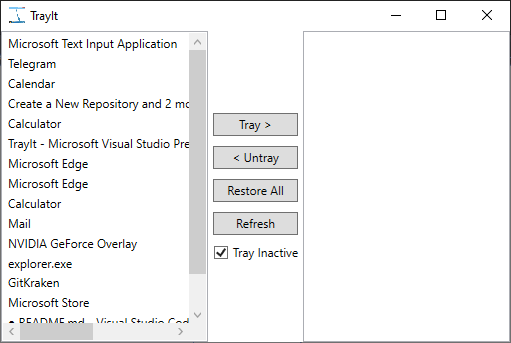
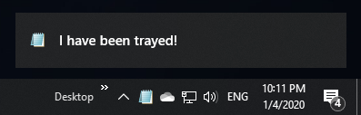

# TrayIt

An application I created back in 2010 that allows you to send any window in Windows to the tray area instead of keeping it on your taskbar.

Has an option to automatically move a window to the tray area when you un-focus it.

